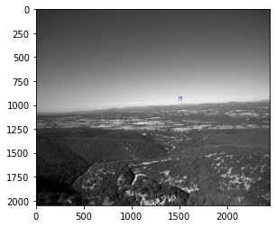

```
aws s3 sync s3://airborne-obj-detection-challenge-training/part1 part1/ --no-sign-request


aws s3 sync s3://airborne-obj-detection-challenge-training/part1 part2/ --no-sign-request


aws s3 sync s3://airborne-obj-detection-challenge-training/part1 part3/ --no-sign-request


```

Sample Image with bbox in the dataset
